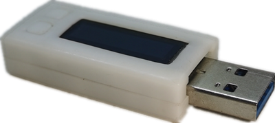

# udisk-dinosaur

---
## 项目简介
本项目通过一个只有6个引脚的MCU(ATtiny10)以及一块128x32的OLED(SSD1306)屏幕实现了一个小游戏机。

---
## 功能描述
由于MCU内部存储空间极其有限(1024字节)，因此本项目的源代码通过汇编语言进行编写，经过调整
优化，在使用完全部1024字节的存储空间后，这个游戏机实现了如下功能：
-  小恐龙跳跃和下蹲动作
-  地面和空中障碍物的随机生成
-  分数统计
-  游戏速度的自动变化
-  通过将一个U盘和游戏机安装到同一个结构中，解决游戏机的供电问题，同时还增加了U盘功能。

---
## 使用方法
接上电源后游戏自动开始运行，通过屏幕旁边的按键控制小恐龙的跳跃和下蹲，以此来躲避地面和空中
的障碍物，另外障碍物移动速度会随着分数的变化而不同，游戏过程中如果小恐龙碰到障碍物，游戏
结束，屏幕熄灭，如果要再次开始，按下跳跃按键即可再次开始。

---
## 本工程使用方法
- Firmware中存放的当前最新的固件，可以直接下载到机器中运行。
- hardware中存放了这个游戏机的3D结构件文件以及电路原理图和PCB生产文件。
- src中存放了软件的源代码，安装AVR相关的编译工具链后即可编译源码。

---
## 鸣谢
本项目是基于[ridoluc](https://github.com/ridoluc)的[RunTiny](https://github.com/ridoluc/RunTiny)项目改进而来。非常感谢他做出如此有意思的项目。
作为感谢，我也对原始项目提交了问题修复的补丁。

---
## 介绍视频
https://www.bilibili.com/video/BV1uh41187qr?spm_id_from=333.999.0.0